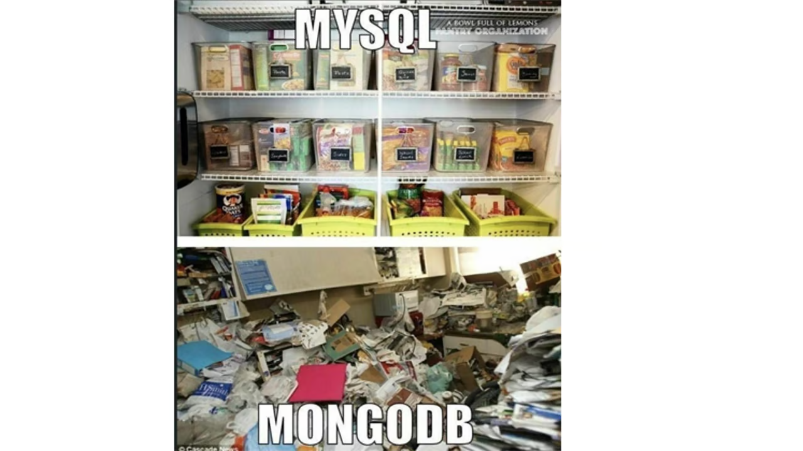
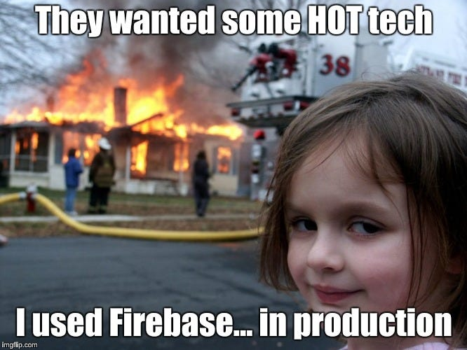

# Database Wars: Comparing Firebase, MongoDB, and SQL 

Hey reader 👋,

I chose this topic because of my 2nd greatest teacher who taught Database and Management Systems in my 1st semester… LOL 😅

Just for educational purposes : 1st position is always held by **#Prashant OP sir** (only IIITL students feel my pain 🥲🥲).

Okay, enough about them!

From that class, I got super curious about how big websites and apps are storing and managing all this massive data, and like... how they do it for free?? And even when we use it, they give us data in just a few seconds (or milliseconds if we're lucky)!

Then I found out about these 3 big databases everyone keeps talking about. So I thought to share them with you:

## MongoDB 🍃

So if i say about mongo db, so its a most popular choice by the Developers , 
because its easy to use , easy to setup.
Also its not follow the pattern of SQL, because its stores its all data in flexiable/ random places.

### Pros:
- **Schema Flexibility:** Yeash , So MongoDb is like a very naughty kid , No its did not that type of work , i say naughty because its throw its data anywhere , Its Not set their data in a manner .

##For example : 

- **Scalability Like a Pro:** Ok So as discussed that its not follow that traditional and boring method to store data in the row and columns like a table. 
That's Why its scalable and you can access this database across multiple servers . 

- **Great for Unstructured Data:** If your app is collecting messy, unstructured data (like images, files, or,prashant sir memes), MongoDB’s Give You access to store all at once.

### Cons:
- **Sometimes Querying is Complex** MongoDB querying isn’t as straightforward as SQL’s, “SELECT * FROM complaints WHERE upvotes > 100.” You’ll need to get cozy with its own query language.
- **Not Always the Best for Complex Relationships:** MongoDB handles data well when it’s loosely connected. But when you need to do a lot of joins (like relating student complaints to admins and guards), MongoDB can feel a bit… messy. Kind of like my code before I debug it. 😅

### Best For:
- **Startups or apps** that deal with unstructured data . Also good for projects where flexibility is key and You are a student of prashant sir . LOL!!

---

## SQL Databases (MySQL, PostgreSQL, etc.) 🧑‍💻

Ah yes, the OGs of databases—the ones we learn in our textbooks but end up fearing during exams. Sql uses tables format with rows and columns , and its uses concepts like primary key and foreign key.

###Interesting Fact 🧑‍🎓🧑‍🎓: SQL is most oldest from all these three, but  still its most popular choice by the developers . 

### Pros:

- **Relational Powerhouse:** SQl Database is so efficient when Your Project complexity is so high . And you need to do so much complex or multiple operations frequently. Then SQL Becomes Your Favorite. 

- **ACID Compliance:** No, not the acid you’re thinking of. This stands for Atomicity, Consistency, Isolation, and Durability—basically (Yeah, I know thats are very heavy Terms But Dont Worry, Bcz You are a pero Developer LOL!! :) ), SQL databases are super reliable when it comes to data integrity.

And also its very safer than the mongodb

- **Mature Ecosystem:** SQL has been around for a long time, which means there are tons of tools, resources, and tutorials (shoutout to Shubhra Ma’am’s PPTs) to help you out.

### Cons:
- **Scaling is a Headache:** Vertical scaling (adding more resources to a single server) is the NightMare here For any developer , which can be expensive and difficult as your app grows. Horizontal scaling (like MongoDB’s chill vibe) is trickier.

- **Rigid Structure:** If you don’t plan your database schema properly, Then Congrats You are Cooked!! :O You can’t just toss in a new field like you can with MongoDB.

### Best For:
- **Large-scale apps** with complex data relationships and a need for reliability and structure. Perfect for projects where data needs to be consistent and relational.

---

## Firebase 🔥

Firebase is like the cool, modern, serverless database that’s all about convenience. It’s hosted in the cloud by Google (yeah, that Google). You don’t have to worry about managing servers or anything like that—just focus on your app and let Firebase handle the rest.

Ignore : Nice rhyming

### Pros:
- **Serverless OP:** No need to spin up servers or maintain anything—Firebase does all that for you. Just connect, and boom, you’ve got a database.
- **Real-time Updates:** Firebase syncs data in real-time, making it perfect for chat apps, live notifications, or anything where data needs to be instantly up-to-date.
- **Authentication Built-In:** It comes with built-in user authentication services, so no need to go find a separate solution for that. Shoutout to Firebase Auth for saving us from yet another headache!

### Cons:
- **Scaling Struggles:** It’s all fun and games until your app blows up in popularity (in a good way, hopefully) and you start hitting Firebase’s scaling limits. You might find it tricky to manage performance when you have a lot of users.
- **Pricing Feels Like a Plot Twist:** It’s free for small projects, but as you scale up, the pricing can hit you like that surprise quiz from Shubhra Ma’am. Startups might feel the pinch when those bills roll in.

### Best For:
- **Startups or small projects** where you want to get up and running fast without worrying about server stuff. If your app’s going to be a simple chat app or a student project, Firebase has your back.

#The Final Showdown ⚔️
###For Startups: If you’re a startup or a student looking to build something quick and dirty (but also functional!), Firebase is your friend. It’s easy to use, integrates with everything, and doesn’t make you worry about the backend.

###For Scaling Like a Boss: If your app is going to scale to infinity and beyond, and you don’t want the headache of strict schemas, MongoDB might be your choice. It’s flexible, scalable, and ready to handle weird data.

###For the Pro Level😎😎, Structured Data Lovers: If you’re building a large-scale app with complex data relationships (and you’re okay with some mental gymnastics during scaling), SQL databases are your best bet. They’re structured, reliable, and will keep your data neatly organized, unlike my notes.